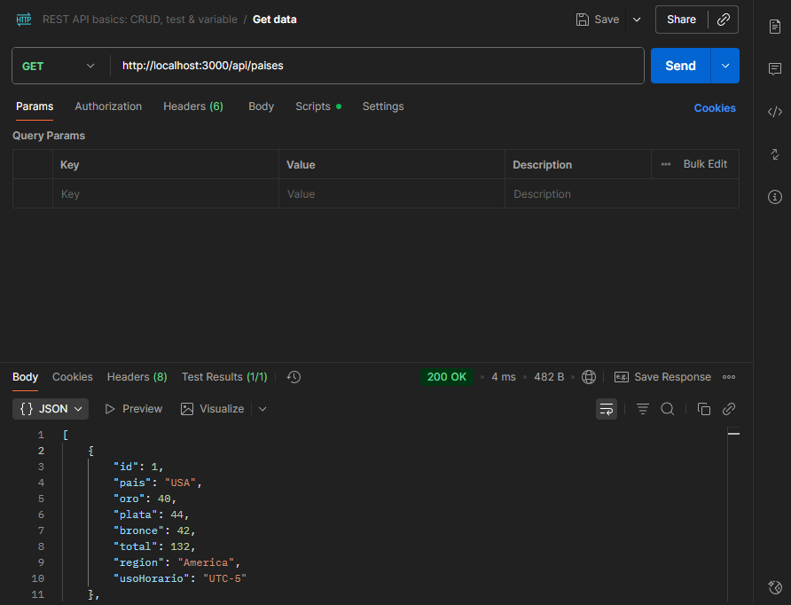
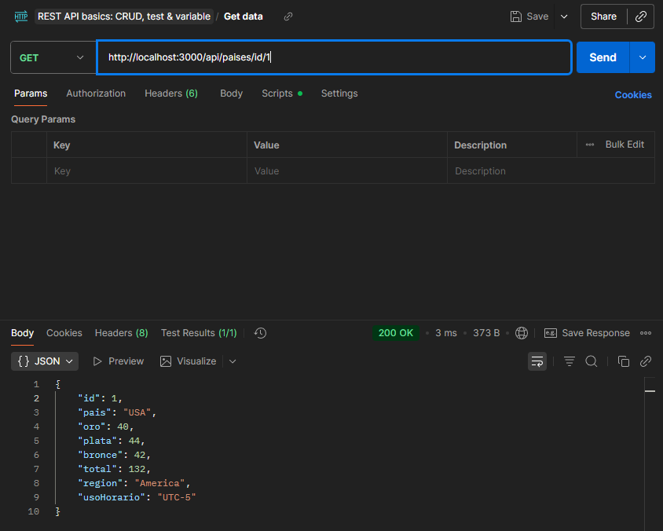
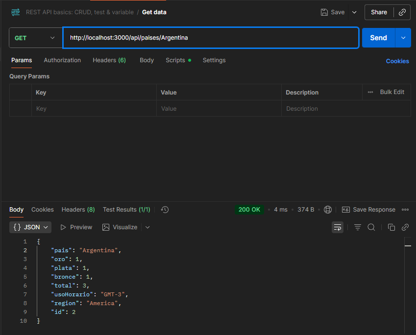
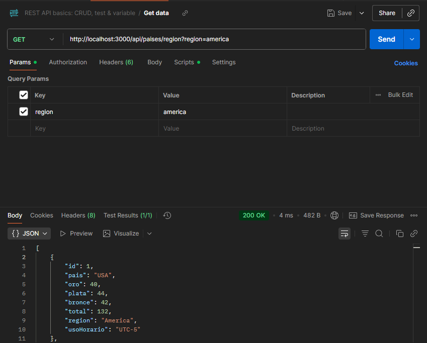
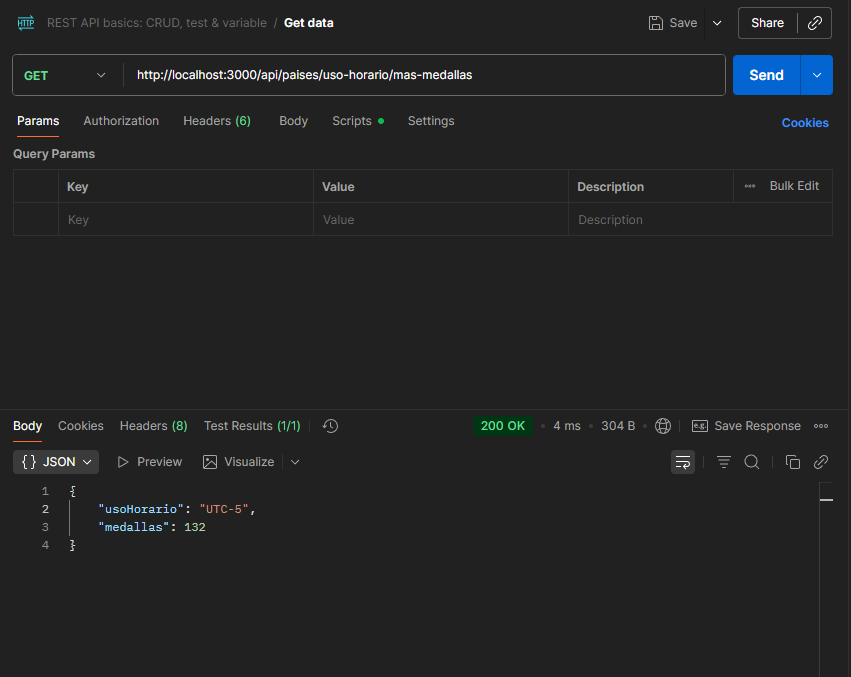
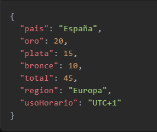
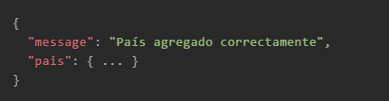
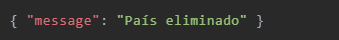

# 🏅 Medallero Olímpico – API REST

## Índice

1. [Base URL](#base-url)
2. [Endpoints](#endpoints)
   1. [Listar todos los países](#1-listar-todos-los-países)
   2. [Obtener país por ID](#2-obtener-país-por-id)
   3. [Obtener país por nombre](#3-obtener-país-por-nombre)
   4. [Filtrar países por región](#4-filtrar-países-por-región)
   5. [Zona horaria con más medallas](#5-zona-horaria-con-más-medallas)
   6. [Crear país](#6-crear-país)
   7. [Actualizar país](#7-actualizar-país)
   8. [Eliminar país](#8-eliminar-país)
3. [Modelo de datos](#modelo-de-datos)
4. [Códigos HTTP](#códigos-http)

---

## Base URL

http://localhost:3000/api/paises

---

## Endpoints

### 1. Listar todos los paises

```http
1. GET /
Respuesta OK (200)
```

1\*


### 2. Obtener por ID

```http
2. GET /id/:id
Ejemplo: /id/1
Respuesta OK (200) → objeto país
404 si no existe
```

2\*


### 3. Obtener por nombre

```http
3. GET /:name
Ejemplo: /Argentina
Case-insensitive
Respuesta OK (200) → objeto país
404 si no existe
```

3\*


### 4. Filtro por region

```http
4. GET /region?region=region
Ejemplo: /region?region=america
Case-insensitive
Respuesta OK (200)
400 si falta ?region=
404 si la región no produce coincidencias
```

4\*


### 5. Uso horario con mas medallas obtenidas

```http
5. GET /uso-horario/mas-medallas
Respuesta OK (200)
404 si no hay datos
```



### 6. Crear Pais

```http
6. POST /
Content-Type: application/json
201 Created
400 si falta pais o los tipos son incorrectos
```




### 7. Actualizar Pais

```http
7. PUT /:id
Content-Type: application/json
Body: cualquier combinación de campos
200 → objeto actualizado
404 si el ID no existe
400 si los datos no pasan la validación
```

### 8. Borrar Pais

```http
8. DELETE /id/:id
Respuesta: OK (200)
404 si el ID no existe
```



---

## Modelo de datos

| Campo         | Tipo   | Descripción                   |
| ------------- | ------ | ----------------------------- |
| `id`          | number | único, auto-incremental       |
| `pais`        | string | nombre del país (obligatorio) |
| `oro`         | number | medallas de oro               |
| `plata`       | number | medallas de plata             |
| `bronce`      | number | medallas de bronce            |
| `total`       | number | suma automática o manual      |
| `region`      | string | ej. "America", "Europa"       |
| `husoHorario` | string | ej. "UTC-5", "GMT-3"          |

---

## Validaciones

- pais es obligatorio y debe ser string no vacío.
- Campos numéricos (oro, plata, bronce, total) deben ser números cuando se envían.
- Campos string (region, husoHorario) deben ser string cuando se envían.

---

## Còdigos HTTP

| Código | Significado                                    |
| ------ | ---------------------------------------------- |
| 200    | OK                                             |
| 201    | Created (al crear país)                        |
| 400    | Bad Request (faltan datos o tipos incorrectos) |
| 404    | Not Found (recurso no encontrado)              |
